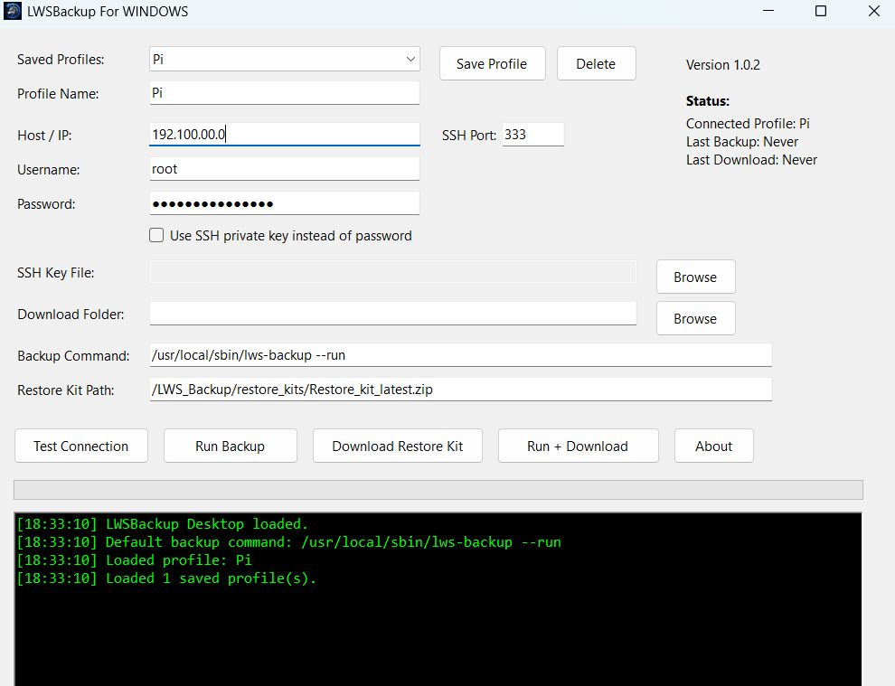

<p align="center">
  
</p>
# LWSBackup Desktop

LWSBackup Desktop is a Windows application that provides a simple graphical interface for running LWSBackup on Raspberry Pi, Allstar, HamVOIP, Debian, and other Linux-based systems.

Instead of manually opening SSH sessions and downloading backup archives, LWSBackup Desktop allows users to run backups and download restore kits with a few clicks.

#
At the moment it is setup to backup only certain folder like 
| Type      | Path                   | Purpose                                                 |
| --------- | ---------------------- | ------------------------------------------------------- |
| Directory | `/srv/http`            | Web server files (Supermon, dashboards, websites, etc.) |
| Directory | `/etc/asterisk`        | Asterisk / AllStar configuration                        |
| File      | `/var/spool/cron/root` | Root user's cron jobs                                   |

#

# LWSBackup Manual Usage Guide

Install and run this program first, it will install all necesary files and settings into your Pi. Then if you like you can run manual commands from terminal'

This guide covers manual operation of LWSBackup directly from a Linux terminal.

## Running LWSBackup

After installation, the following command should be available:

```bash
lws-backup
```

The command is typically installed as:

```text
/usr/local/sbin/lws-backup
/usr/local/bin/lws-backup
```

You can verify installation with:

```bash
which lws-backup
```

Expected output:

```text
/usr/local/sbin/lws-backup
```

---

# Command Line Options

## Display Help

Show available options and usage information:

```bash
lws-backup --help
```

---

## Run a Backup

Execute a backup immediately using the active configuration:

```bash
lws-backup --run
```

This will:

* Create a backup ZIP
* Create a restore kit ZIP
* Verify both archives
* Apply retention settings
* Upload via FTP if configured

---

## Initial Setup Wizard

Run the configuration wizard:

```bash
lws-backup --setup
```

Use this option to:

* Configure backup targets Folder or files
* Configure FTP settings
* Configure retention values, how many backups to keep on the Pi at any given time. Both backup and Restore kits are set at 4 files each
* Configure scheduled backups
* Create or modify profiles

---

## Interactive Menu

Launch the full interactive menu:

```bash
lws-backup --menu
```

This provides access to all LWSBackup functions through a menu-driven interface.

---

## Install or Repair LWSBackup

Install or reinstall the application:

```bash
lws-backup --install
```

This will:

* Create required folders
* Create configuration files
* Create symbolic links
* Install missing dependencies
* Verify installation

---

# Interactive Menu Options

The interactive menu provides the following functions.

## Run Backup Now

Immediately executes:

```bash
lws-backup --run
```

Useful for manual backups.

---

## Setup Wizard

Launches:

```bash
lws-backup --setup
```

Allows modification of all configuration settings.

---

## View Current Configuration

Displays:

* Active profile
* Backup targets
* FTP configuration
* Retention settings
* Backup locations

---

## Manage Profiles

Create, edit, or switch profiles.

Profiles allow different backup configurations to be stored and reused.

Examples:

```text
Default
Production
Testing
GMRS
WebServer
```

---

## Configure Backup Targets

Add or remove folders and files included in backups.

Examples:

```text
/srv/http
/etc/asterisk
/etc/apache2
/home
/opt
```

---

## Configure FTP Uploads

Enable automatic off-site backup uploads.

Settings include:

* FTP Host
* FTP Port
* FTP Username
* FTP Password
* Remote Directory

---

## Configure Retention Settings

Control how many files are retained.

Default values:

```text
Backups: 4
Restore Kits: 4
Logs: 10
```

---

## View Logs

Display recent LWSBackup log entries.

Logs are stored in:

```text
/LWS_Backup/logs
```

---

## Exit

Exit the menu and return to the Linux shell.

---

# Important Directories

## Main Application Folder

```text
/LWS_Backup
```

---

## Backup Archives

```text
/LWS_Backup/backups
```

Contains timestamped backup ZIP files.

---

## Restore Kits

```text
/LWS_Backup/restore_kits
```

Contains timestamped restore kit ZIP files.

---

## Configuration Files

```text
/LWS_Backup/config
```

Contains:

* Profiles
* Backup targets
* FTP settings
* Retention settings

---

## Logs

```text
/LWS_Backup/logs
```

Contains backup and installation logs.

---

# Useful Commands

Run a backup:

```bash
lws-backup --run
```

Open the setup wizard:

```bash
lws-backup --setup
```

Open the interactive menu:

```bash
lws-backup --menu
```

Display help:

```bash
lws-backup --help
```

Reinstall or repair:

```bash
lws-backup --install
```

Verify installation:

```bash
which lws-backup
```


## Features

- Saved node profiles
- Password authentication
- SSH key authentication
- Test SSH connection
- Run remote LWSBackup backups
- Download restore kits
- Run backup and download in one step
- Download progress tracking
- Activity log window
- Windows MSI installer
- Desktop and Start Menu shortcuts

## Requirements

### Windows Computer

- Windows 10 or Windows 11
- Network access to the target Linux node

### Target Linux Node

The target system must have:

- SSH enabled
- LWSBackup installed
- A working LWSBackup configuration

Default backup command:

```bash
/usr/local/sbin/lws-backup --run
```

Default restore kit path:

```text
/LWS_Backup/restore_kits/Restore_kit_latest.zip
```

## Installation

1. Download the latest `.msi` installer from the Releases page.
2. Run the installer.
3. Follow the setup wizard.
4. Launch **LWSBackup Desktop** from the Desktop or Start Menu.

Recommended installer filename:

```text
LWSBackupDesktop-1.0.1-x64.msi
```

## Quick Start

### 1. Create a Node Profile

Enter the following information:

- Profile Name
- Host/IP Address
- SSH Port
- Username
- Password or SSH Key
- Local download folder

Click:

```text
Save Profile
```

### 2. Test the Connection

Click:

```text
Test Connection
```

If successful, the application will confirm that SSH access is working.

### 3. Run a Backup

Click:

```text
Run Backup
```

The application will execute the configured backup command on the remote system.

### 4. Download the Restore Kit

Click:

```text
Download Restore Kit
```

The latest restore kit will be downloaded to the selected local folder.

### 5. Run Backup and Download Automatically

Click:

```text
Run + Download
```

This will run the backup and then download the latest restore kit automatically.

## Default Paths

Backup command:

```bash
/usr/local/sbin/lws-backup --run
```

Restore kit path:

```text
/LWS_Backup/restore_kits/Restore_kit_latest.zip
```

## Saved Profiles

Profiles are saved locally on the Windows computer.

Saved profile data includes:

- Profile name
- Host/IP
- SSH port
- Username
- Authentication method
- Download folder
- Backup command
- Restore kit path

Passwords are encrypted using the current Windows user account.

## Troubleshooting

### The app cannot connect

Check:

- The target node is powered on
- SSH is enabled
- The IP address is correct
- The username and password are correct
- Port 22 is reachable or whatever port your system is using

### Backup runs but download fails

Verify that this file exists on the target system:

```text
/LWS_Backup/restore_kits/Restore_kit_latest.zip
```

### Installer says a newer or older version exists

Uninstall the previous version from Windows Apps & Features, then install the new MSI.

Future releases should support upgrade installs when the MSI version is increased correctly.

## Version

Current version:

```text
1.0.2
```

## Author

Created by Alex Dominguez / N4ASS

The Lone Wolf System
