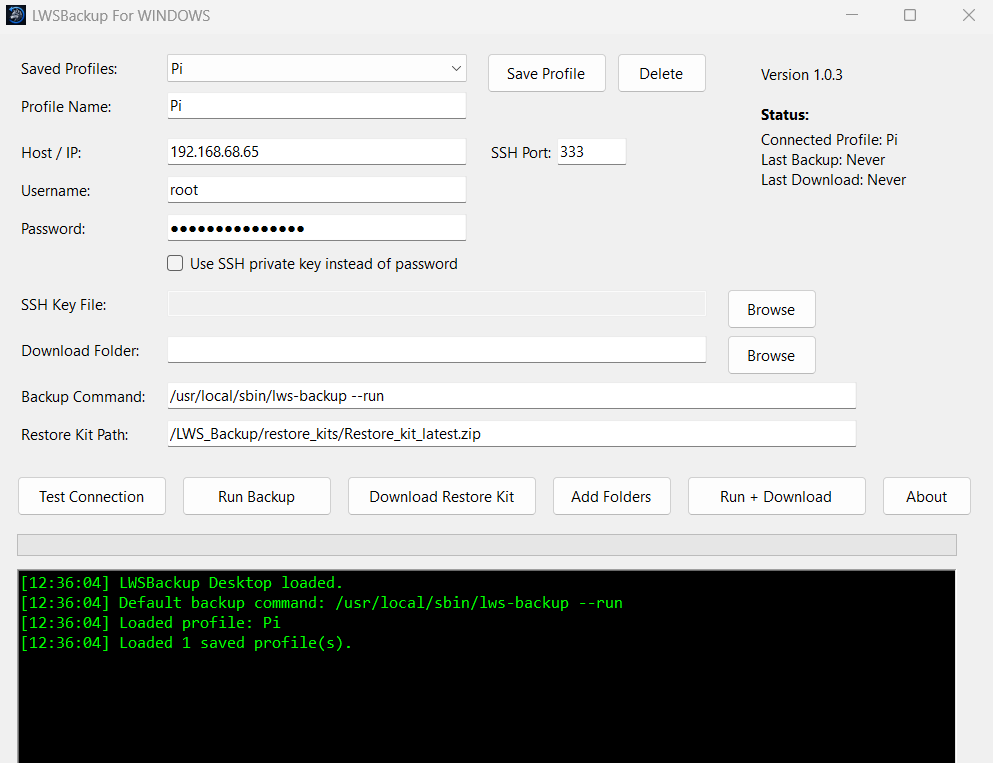

<p align="center">
  
</p>


# LWSBackup Desktop

LWSBackup Desktop is a Windows application that provides a simple graphical interface for running LWSBackup on Raspberry Pi, Allstar, HamVOIP, Debian, and other Linux-based systems.

Instead of manually opening SSH sessions and downloading backup archives, LWSBackup Desktop allows users to run backups and download restore kits with a few clicks.

### Supported Systems

- Raspberry Pi OS
- Debian
- Ubuntu
- HamVOIP
- AllStarLink
- AllStarLink 3
- Linux Mint
- Most Debian-based Linux distributions
- Should work in other Linux Systems you will have to try.

### Optional default targets (Linux script)

| Type      | Path                   | Purpose                                                 |
| --------- | ---------------------- | ------------------------------------------------------- |
| Directory | `/srv/http`            | Web server files (Supermon, dashboards, websites, etc.) |
| Directory | `/etc/asterisk`        | Asterisk / AllStar configuration                        |
| File      | `/var/spool/cron/root` | Root user's cron jobs                                   |

New installs start with an empty `targets.conf` until you run setup or add targets from the menu. Existing systems that already have targets are not changed.

> **Note:** LWSBackup Desktop releases use their own version (for example v1.0.4). The Linux `lws-backup` script version is separate (currently v17).

## Backup Targets

LWSBackup now supports custom backup targets.

Backup targets can be configured either:

- From the Linux setup wizard (`lws-backup --setup`)
- From the Windows Desktop application

The Windows application now includes a built-in Linux File Browser that can:

- Connect to a remote Linux node using SSH
- Display files, folders, and symbolic links
- Browse the remote filesystem
- Add custom files or folders as backup targets
- Remove backup targets
- Save backup target selections locally

Examples:

```text
/etc/asterisk
/etc/apache2
/home
/opt
/srv/http
/var/spool/cron/root
```

Users are no longer limited to the default backup paths and may select any file or folder they wish to include in their backups.
#

 ### Configure Backup Targets (Optional)

Click:

```text
Add Folders
```

This opens the Backup Target Manager.

From here you can:

- Scan the remote Linux filesystem
- Browse files and folders
- Browse symbolic links
- Add custom backup targets
- Remove backup targets
- Save target selections

This allows backups to include files and directories beyond the default LWSBackup configuration.

---

# LWSBackup Manual Usage Guide

Install and run this program first; it will install all necessary files and settings on your Pi. You can then run manual commands from the terminal if you prefer.

This guide covers manual operation of LWSBackup directly from a Linux terminal.

## Running LWSBackup

After installation, the following command should be available:

```bash
lws-backup
```

The command is typically installed as:

```text
/usr/local/sbin/lws-backup
/usr/local/bin/lws-backup
```

You can verify installation with:

```bash
which lws-backup
```

Expected output:

```text
/usr/local/sbin/lws-backup
```

### Install from a git checkout

On the Linux node (or from a copy of this repository):

```bash
git clone https://github.com/hardenedpenguin/LWSBackup.git
cd LWSBackup
sudo ./lws-backup --install
```

This copies the modular script tree to `/LWS_Backup/scripts` and creates the `lws-backup` command. Run `sudo lws-backup --install` again anytime to repair or upgrade the installed scripts.

---

# Command Line Options

## Display Help

Show available options and usage information:

```bash
lws-backup --help
```

Show the script version:

```bash
lws-backup --version
```

---

## Run a Backup

Execute a backup immediately using the active configuration:

```bash
lws-backup --run
```

This will:

* Create a backup ZIP
* Create a restore kit ZIP
* Verify both archives
* Apply retention settings
* Upload via FTP if configured (local archives are kept if FTP fails)

At least one backup target must be configured before `--run` will succeed. Use `--setup` or `--menu` to add targets.

---

## Initial Setup Wizard

Run the configuration wizard:

```bash
lws-backup --setup
```

Use this option to:

* Configure general settings (backup/restore kit name prefixes, retention)
* Optionally install HamVOIP/AllStar default targets
* Add custom backup target folders or files
* Configure FTP settings (including optional delete-local-after-upload)
* Configure scheduled backups
* Create or modify profiles

---

## Interactive Menu

Launch the full interactive menu:

```bash
lws-backup --menu
```

This provides access to all LWSBackup functions through a menu-driven interface.

---

## Install or Repair LWSBackup

Install or reinstall the application:

```bash
lws-backup --install
```

This will:

* Create required folders
* Create configuration files
* Create symbolic links
* Install missing dependencies
* Verify installation

---

# Interactive Menu Options

The interactive menu provides the following functions.

## Run Backup Now

Immediately executes:

```bash
lws-backup --run
```

Useful for manual backups.

---

## Setup Wizard

Launches:

```bash
lws-backup --setup
```

Allows modification of all configuration settings.

---

## General Settings

Configure from the Linux menu:

* Backup ZIP name prefix
* Restore kit ZIP name prefix
* Retention (backups, restore kits, logs)

The menu header also shows active profile and FTP enabled/disabled status.

---

## Manage Profiles

Create, edit, or switch profiles.

Profiles allow different backup configurations to be stored and reused.

Examples:

```text
Default
Production
Testing
GMRS
WebServer
```

---

## Configure Backup Targets

Add, remove, or reset folders and files included in backups from the Linux menu (**Backup Targets**).

* Add folder or file targets
* Remove individual targets
* Reset to optional HamVOIP/AllStar legacy defaults
* Edit `targets.conf` manually

Examples:

```text
/srv/http
/etc/asterisk
/etc/apache2
/home
/opt
```

---

## Configure FTP Uploads

Enable automatic off-site backup uploads.

Settings include:

* FTP Host
* FTP Port
* FTP Username
* FTP Password
* Remote Directory
* Delete timestamped local files after successful upload (optional, default: off)

---

## Configure Retention Settings

Control how many files are retained. Configure from **General Settings** in the Linux menu (also sets backup and restore kit ZIP name prefixes).

Default values:

```text
Backups: 4
Restore Kits: 4
Logs: 10
```

---

## View Logs

Display recent LWSBackup log entries.

Logs are stored in:

```text
/LWS_Backup/logs
```

---

## Exit

Exit the menu and return to the Linux shell.

---

# Important Directories

## Main Application Folder

```text
/LWS_Backup
```

---

## Backup Archives

```text
/LWS_Backup/backups
```

Contains timestamped backup ZIP files and a latest copy:

```text
Backup_<hostname>_<timestamp>.zip
Backup_latest.zip
```

(With default prefix `Backup`. Custom prefixes use `<prefix>_latest.zip`.)

---

## Restore Kits

```text
/LWS_Backup/restore_kits
```

Contains timestamped restore kit ZIP files and a latest copy:

```text
Restore_kit_<hostname>_<timestamp>.zip
Restore_kit_latest.zip
```

(With default prefix `Restore_kit`. Custom prefixes use `<prefix>_latest.zip`.)

Inside the restore kit zip, the extracted folder name matches the restore kit prefix (default: `Restore_kit`).

---

## Configuration Files

```text
/LWS_Backup/config
```

Contains:

* Profiles
* Backup targets
* FTP settings
* Retention settings

---

## Logs

```text
/LWS_Backup/logs
```

Contains backup and installation logs.

---

# Useful Commands

Run a backup:

```bash
lws-backup --run
```

Open the setup wizard:

```bash
lws-backup --setup
```

Open the interactive menu:

```bash
lws-backup --menu
```

Display help:

```bash
lws-backup --help
```

Show version:

```bash
lws-backup --version
```

Reinstall or repair:

```bash
lws-backup --install
```

Restore from a restore kit (interactive prompt):

```bash
lws-backup --restore
```

Verify installation:

```bash
which lws-backup
```


## Features

- Saved node profiles
- Password authentication
- SSH key authentication
- Test SSH connection
- Run remote LWSBackup backups
- Download restore kits
- Run backup and download in one step
- Download progress tracking
- Activity log window
- Windows MSI installer
- Desktop and Start Menu shortcuts

### Backup Target Management (NEW in v1.0.4)

- Remote Linux file browser
- Live SSH filesystem scanning
- Browse files, folders, and symbolic links
- Add custom backup targets
- Remove backup targets
- Save backup target selections
- Support for custom files and directories

## Requirements

### Windows Computer

- Windows 10 or Windows 11
- Network access to the target Linux node

### Target Linux Node

The target system must have:

- SSH enabled
- LWSBackup installed
- A working LWSBackup configuration

Default backup command:

```bash
/usr/local/sbin/lws-backup --run
```

Default restore kit path (when using default prefix `Restore_kit`):

```text
/LWS_Backup/restore_kits/Restore_kit_latest.zip
```

If you change the restore kit prefix in **General Settings**, update the Windows Desktop restore kit path to match (for example `MyKit_latest.zip`).

## Installation

1. Download the latest `.msi` installer from the Releases page.
2. Run the installer.
3. Follow the setup wizard.
4. Launch **LWSBackup Desktop** from the Desktop or Start Menu.

Recommended installer filename:

```text
LWSBackupDesktop-1.0.1-x64.msi
```

## Quick Start

### 1. Create a Node Profile

Enter the following information:

- Profile Name
- Host/IP Address
- SSH Port
- Username
- Password or SSH Key
- Local download folder

Click:

```text
Save Profile
```

### 2. Test the Connection

Click:

```text
Test Connection
```

If successful, the application will confirm that SSH access is working.

### 3. Run a Backup

Click:

```text
Run Backup
```

The application will execute the configured backup command on the remote system.

### 4. Download the Restore Kit

Click:

```text
Download Restore Kit
```

The latest restore kit will be downloaded to the selected local folder.

### 5. Run Backup and Download Automatically

Click:

```text
Run + Download
```

This will run the backup and then download the latest restore kit automatically.

## Default Paths

Backup command:

```bash
/usr/local/sbin/lws-backup --run
```

Restore kit path (default prefix):

```text
/LWS_Backup/restore_kits/Restore_kit_latest.zip
```

## Saved Profiles

Profiles are saved locally on the Windows computer.

Saved profile data includes:

- Profile name
- Host/IP
- SSH port
- Username
- Authentication method
- Download folder
- Backup command
- Restore kit path

Passwords are encrypted using the current Windows user account.

## Troubleshooting

### The app cannot connect

Check:

- The target node is powered on
- SSH is enabled
- The IP address is correct
- The username and password are correct
- Port 22 is reachable or whatever port your system is using

### Backup runs but download fails

Verify that the latest restore kit exists on the target system (default path):

```text
/LWS_Backup/restore_kits/Restore_kit_latest.zip
```

### Backup fails with no targets copied

Add at least one backup target:

```bash
sudo lws-backup --menu
```

Choose **Backup Targets**, or run `sudo lws-backup --setup` and install/add targets.

### FTP enabled but files remain local

FTP upload failure does not roll back a successful backup. Local archives are kept and a warning is logged. Check `/LWS_Backup/logs` and FTP settings.

### Installer says a newer or older version exists

Uninstall the previous version from Windows Apps & Features, then install the new MSI.

Future releases should support upgrade installs when the MSI version is increased correctly.

## Version

Current version:

```text
1.0.4
```

## What's New in v1.0.4

### Backup Target Manager

This release introduces the first version of the Backup Target Manager.

New capabilities include:

- Remote Linux filesystem browsing
- SSH-powered filesystem scanning
- File and directory selection
- Backup target management interface
- Improved user interface and navigation
- Larger management windows and controls
- Improved workflow for custom backup configurations

Future releases will synchronize custom backup targets directly to the Linux node and integrate them into the backup engine.

### Linux backup script improvements (v17)

The Linux `lws-backup` script includes:

* Optional HamVOIP/AllStar defaults during setup (no longer forced on new installs)
* Remove individual backup targets from the Linux menu
* Canonical `config_*` and `targets_*` APIs (legacy aliases removed)
* Configurable backup and restore kit ZIP prefixes
* Safer restore flow (dry-run failure does not trigger live restore)
* Dynamic restore kit folder naming inside the zip
* FTP delete-local-after-upload option (off by default)

## Development

Repository layout:

```text
lws-backup              # repo-root wrapper (same name as installed command)
scripts/lws-backup      # modular entrypoint
scripts/lib/            # core logic (no dialog UI)
scripts/ui/             # menus and dialog helpers
scripts/commands/       # CLI handlers (--run, --menu, etc.)
scripts/templates/      # restore.sh template for restore kits
tests/                  # bats unit tests
```

Run tests locally (requires [bats](https://github.com/bats-core/bats-core)):

```bash
tests/run.sh
```

CI runs ShellCheck on all shell scripts and bats on every push to `main`.

See [CHANGELOG.md](CHANGELOG.md) for script release notes.

## Author

Created by Alex Dominguez / N4ASS

The Lone Wolf System
